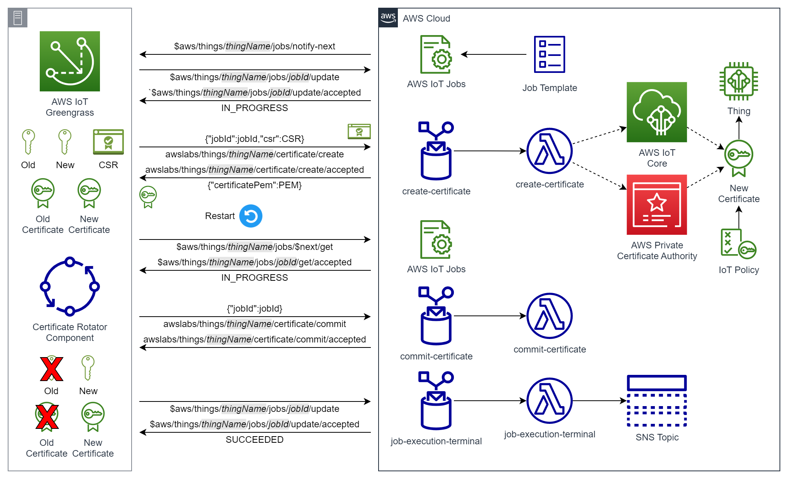
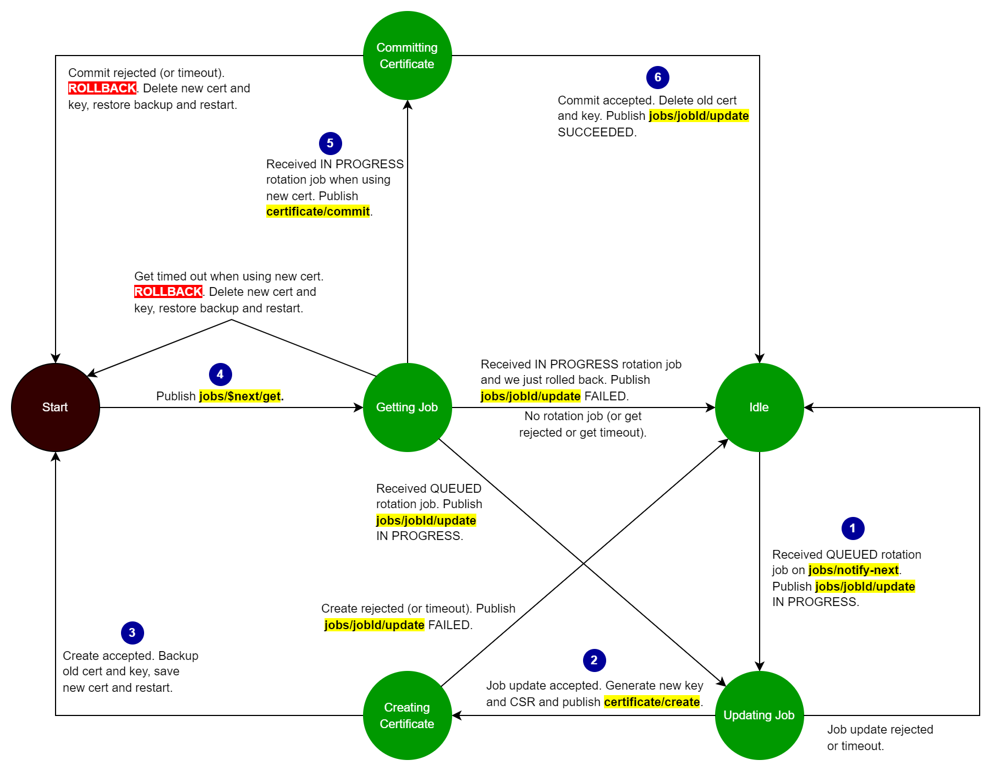

# AWS Greengrass Labs Certificate Rotator

Device certificate and private key rotation is a [security best practice laid out by the IoT Lens for the AWS Well-Architected Framework](https://docs.aws.amazon.com/wellarchitected/latest/iot-lens-checklist/design-principle-6.html). At the time of writing however, AWS IoT does not offer a device certificate rotation service or feature. It's left to customers and application builders to implement both the device software and the cloud backend to achieve device certificate rotation.

To guide customers in this implementation, AWS offers a [device certificate rotation blog](https://aws.amazon.com/blogs/iot/how-to-manage-iot-device-certificate-rotation-using-aws-iot/), an [IoT Jumpstart workshop](https://catalog.us-east-1.prod.workshops.aws/workshops/001cd52d-8105-4da9-a0c2-ee391260e0c7/en-US/operations/lab30-devicecertrotation) and the [Connected Device Framework (CDF) Certificate Vendor module](https://github.com/aws/aws-connected-device-framework/tree/main/source/packages/services/certificatevendor). These are documented rotation procedures and/or partial implementations.

In general, it's challenging to offer a full end-to-end device certificate and private key rotation reference implementation because the device software is heavily dependent on the device hardware. In particular, certificate and private key storage and APIs are strongly influenced by the hardware and the Hardware Abstraction layer (HAL). However, AWS IoT Greengrass offers a unique opportunity to build a reference implementation because it standardizes the certificate and private key storage via the [Greengrass Core software installation configuration](https://docs.aws.amazon.com/greengrass/v2/developerguide/manual-installation.html#run-greengrass-core-v2-installer-manual). The location of the certificate and private key are defined by the **certificateFilePath** and **privateKeyPath** configuration parameters. These may be defined as files on disk or as [PKCS#11 objects in a Hardware Security Module (HSM)](https://docs.aws.amazon.com/greengrass/v2/developerguide/hardware-security.html).

Consequently this repository delivers a full end-to-end device certificate and private key rotation reference implementation for Greengrass core devices. A Greengrass component named **aws.greengrass.labs.CertificateRotator** delivers the device part of the contract and an AWS Cloud Development Kit (CDK) stack delivers the companion cloud backend. The component supports credentials stored as files or stored in an HSM. The cloud backend supports certificates issued by either AWS IoT Core or by [AWS Private Certificate Authority (CA)](https://aws.amazon.com/private-ca/). The cloud backend can also be adopted by non-Greengrass devices, with the device software developed to match the functionality of the Greengrass component.

# Table of Contents
* [Repository Contents](#repository-contents)
* [System Design](#system-design)
  * [Architecture](#architecture)
  * [Message Sequence](#message-sequence)
  * [Component State Machine](#component-state-machine)
  * [Design Goals](#design-goals)
* [Requirements and Prerequisites](#requirements-and-prerequisites)
  * [Greengrass Core Device](#greengrass-core-device)
    * [Platform](#platform)
    * [Python Requirements](#python-requirements)
    * [Hardware Security Module](#hardware-security-module)
    * [Edge Runtime](#edge-runtime)
  * [Greengrass Cloud Services](#greengrass-cloud-services)
    * [Core Device Role](#core-device-role)
    * [IoT Policy](#iot-policy)
  * [Developer Machine](#developer-machine)
    * [AWS CLI](#aws-cli)
    * [AWS CDK](#aws-cdk)
    * [Python](#python)
    * [GDK CLI](#gdk-cli)
* [Getting Started](#getting-started)
  * [Cloud Backend](#cloud-backend)
  * [Component](#component)
    * [Build and Publish](#build-and-publish)
    * [Deploy](#deploy)
  * [Notifications](#notifications)
  * [Certificate Rotation Jobs](#certificate-rotation-jobs)
    * [Console](#console)
    * [Fleet Hub](#fleet-hub)
    * [CLI](#cli)
* [Configuration](#configuration)
  * [Component Configuration](#configuration)
  * [Cloud Backend Configuration](#configuration)
* [Troubleshooting](#troubleshooting)
  * [Troubleshooting Tools](#troubleshooting-tools)
    * [Core Device: Component Log File](#core-device-component-log-file)
    * [Cloud Backend: Lambda CloudWatch Log Groups](#cloud-backend-lambda-cloudwatch-log-groups)
  * [Common Errors](#common-errors)
    * [Interpolation Not Enabled](#interpolation-not-enabled)
    * [Job Execution Events Disabled](#job-execution-events-disabled)
* [Development and Testing](#development-and-testing)
  * [Static Analysis](#static-analysis)
  * [Unit Tests](#unit-tests)
  * [Security Scanning](#security-scanning)
  * [Automated Integration Tests](#automated-integration-tests)
  * [CI/CD Pipeline](#cicd-pipeline)
  * [CDK Unit Tests](#cdk-unit-tests)
  * [CDK Nag](#cdk-nag)
  * [Test Fleet](#test-fleet)

# Repository Contents

| Item                          | Description                                                                                           |
| ----------------------------- | ----------------------------------------------------------------------------------------------------- |
| /artifacts                    | Greengrass V2 component artifacts that run on the Greengrass edge runtime.                            |
| /backend                      | CDK Typescript application for the cloud backend.                                                     |
| /cicd                         | CDK Typescript application for the CodePipeline CI/CD pipeline.                                       |
| /images                       | Images for README files.                                                                              |
| /libs                         | Python libraries shared by Python scripts.                                                            |
| /robot                        | Robot Framework integration tests.                                                                    |
| /tests                        | Pytest unit tests.                                                                                    |
| deploy_component_version.py   | Deploys a component version to a Thing group of Greengrass core devices.                              |
| gdk_build.py                  | Custom build script for the Greengrass Development Kit (GDK) - Command Line Interface.                |
| gdk-config.json               | Configuration for the Greengrass Development Kit (GDK) - Command Line Interface.                      |
| recipe.yaml                   | Greengrass V2 component recipe template.                                                              |


# System Design

## Architecture

An overview of the system architecture is presented below. The solution consists of the Greengrass Certificate Rotator component and a cloud backend that is principally comprised of three Lambda functions, three AWS IoT Core rules, an [AWS IoT custom job template](https://docs.aws.amazon.com/iot/latest/developerguide/job-templates.html) and a Simple Notification Service (SNS) topic. Certificates are issued by either AWS IoT Core or by AWS Private CA.

The sequence of MQTT message topics for a successful certificate and private key rotation is also shown.



As can be seen, the Certificate Rotator component and backend make use of both [AWS IoT Jobs](https://docs.aws.amazon.com/iot/latest/developerguide/iot-jobs.html) and custom MQTT topics. The cloud application initiates a certificate and private key rotation by creating an AWS IoT custom job using the custom job template. This creates a certificate rotation job that targets one or more Things. Trigger conditions and business logic for the job creation are left to the customer or application developer.  In other words, this solution provides the means of rotating a device certificate and private key without dictating when or why it should be done.

With the AWS IoT job bookending the process, custom topics are used to create and commit a new device certificate. The SNS topic is used to notify subscribers of any certificate rotation failures.

## Message Sequence

With reference to the architecture diagram:

| Topic                                                  | Description |
| ------------------------------------------------------ | ----------- |
| `$aws/things/thingName/jobs/notify-next`               | The Certificate Rotator component is notified of a new certificate rotation job. |
| `$aws/things/thingName/jobs/jobId/update`              | The component updates the job execution status to `IN_PROGRESS`. |
| `$aws/things/thingName/jobs/jobId/update/accepted`     | The cloud notifies the component that the job execution update is accepted. The Certificate Rotator component generates a new private key and creates a Certificate Signing Request (CSR) from it. |
| `awslabs/things/thingName/certificate/create`          | The component sends the CSR to the cloud backend, along with the job ID so that strict chain of custody can be maintained. The `create-certificate` Lambda validates the creation request and creates the new certificate, using either AWS IoT or AWS Private CA. It attaches IoT policies to the new certificate and attaches the new certificate to the Thing. |
| `awslabs/things/thingName/certificate/create/accepted` | The cloud backend returns the new certificate to the Certificate Rotator component. The component backs up the old certificate, installs the new certificate on disk or in the HSM, and restarts the Greengrass service so that it will attempt to connect using the new certificate and private key. |
| `$aws/things/thingName/jobs/$next/get`                 | Upon restarting, the component attempts to get the latest job context. |
| `$aws/things/thingName/jobs/jobId/get/accepted`        | If the new certificate and private key are good, the job execution status is returned by the cloud and the status is `IN_PROGRESS`. (Should the component fail to receive this message, rollback would begin.) |
| `awslabs/things/thingName/certificate/commit`          | The component asks the cloud backend to attempt to commit to the new certificate. The request includes the job ID so that strict chain of custody can be maintained. The `commit-certificate` Lambda validates the request and verifies that the principal used to make the MQTT connection is the new certificate. |
| `awslabs/things/thingName/certificate/commit/accepted` | The cloud backend notifies the component that the new certificate is good and can be committed. The component deletes the old certificate and private key. |
| `$aws/things/thingName/jobs/jobId/update`              | The component updates the job executon status to `SUCCEEDED`. The `job-execution-terminal` Lambda deletes the old certificate from the AWS ioT Core registry. |
| `$aws/things/thingName/jobs/jobId/update/accepted`     | The cloud notifies the component that the job is completed. |

Should any errors occur, the job execution will terminate with state `FAILED` or `TIMED_OUT` causing the `job-execution-terminal` Lambda to issue a notification on the SNS topic. If an error occurs after the new certificate and private key are installed on Greengrass, a rollback will occur.

## Component State Machine

The Certificate Rotator component implements a state machine as illustrated below. The blue numbers indicate the progression normally followed during a successful rotation.



## Design Goals

This component and cloud backend take inspiration from the [device certificate rotation blog](https://aws.amazon.com/blogs/iot/how-to-manage-iot-device-certificate-rotation-using-aws-iot/), the [IoT Jumpstart workshop](https://catalog.us-east-1.prod.workshops.aws/workshops/001cd52d-8105-4da9-a0c2-ee391260e0c7/en-US/operations/lab30-devicecertrotation) and the [Connected Device Framework (CDF) Certificate Vendor module](https://github.com/aws/aws-connected-device-framework/tree/main/source/packages/services/certificatevendor). All three approaches have their merits, but this repository attempts to deliver an enhanced solution with the following design goals:

1. Rotate both the private key and the device certificate.
2. Use AWS IoT Jobs to encapsulate the rotation process and manage fleets at scale. This allows fleet operators to:
    - Trigger rotation for devices that may currently be offline. 
    - Use [Job rollout, scheduling and abort configurations](https://docs.aws.amazon.com/iot/latest/developerguide/jobs-configurations-details.html#job-rollout-abort) to perform canary rotations, to perform rotations during maintenance windows and to guard against throttling. 
    - Use [Job timeout configuration and job retry configurations](https://docs.aws.amazon.com/iot/latest/developerguide/jobs-configurations-details.html#job-timeout-retry) to rotate in a more resilient, robust and timely manner.
    - Target specific sub-collections of devices using [Thing types](https://docs.aws.amazon.com/iot/latest/developerguide/thing-types.html), thing attributes, [static thing groups](https://docs.aws.amazon.com/iot/latest/developerguide/thing-groups.html), [dynamic thing groups](https://docs.aws.amazon.com/iot/latest/developerguide/dynamic-thing-groups.html) and [fleet indexing](https://docs.aws.amazon.com/iot/latest/developerguide/iot-indexing.html).
    - Conveniently trigger rotations on demand from the AWS IoT Console or from [Fleet Hub for AWS IoT Device Management](https://docs.aws.amazon.com/iot/latest/fleethubuserguide/what-is-aws-iot-monitor.html).
    - Use AWS IoT Console or [Fleet Hub for AWS IoT Device Management](https://docs.aws.amazon.com/iot/latest/fleethubuserguide/what-is-aws-iot-monitor.html) for better visibility into rotation status and progress across the fleet.
    - Use the job to bookend the rotation process so that the [job execution terminal status](https://docs.aws.amazon.com/iot/latest/developerguide/iot-jobs-lifecycle.html#iot-job-execution-states) indicates success or failure of the rotation operation.
3. Do not mandate [AWS IoT Device Defender](https://docs.aws.amazon.com/iot/latest/developerguide/device-defender.html) [device certificate expiring check](https://docs.aws.amazon.com/iot/latest/developerguide/audit-chk-device-cert-approaching-expiration.html) as the only rotation trigger. Customers and application developers should be free to choose an appropriate trigger to suit their own business needs. 
4. In addition to AWS IoT certificates, support [AWS Private Certificate Authority (CA)](https://docs.aws.amazon.com/privateca/latest/userguide/PcaWelcome.html) as a Certificate Authority (CA) and to issue device certificates. This gives customers the option to use their own CA and therefore control device certificate expiry dates. The AWS IoT Device Defender device certificate expiring check only makes sense as a trigger if a customer can control the expiry date.
5. Have the cloud backend explicitly check what principal was used to authenticate the connection when the core device first connects with the new certificate. This is to guard against the device erroneously using its old certificate and mistakenly thinking it used the new one (a potentially very serious error).
6. Have the cloud backend demand that the MQTT client ID match the Thing name, as per [best practice](https://docs.aws.amazon.com/wellarchitected/latest/iot-lens/identity-and-access-management-iam.html). This guards against mismatch between things as job targets and MQTT client names.
7. Likewise demand that each device has just one device certificate attached to it (in the AWS IoT Core registry) and each device has a unique device certificate.
8. Maintain strict chain of custody, ensuring that certificate create and commit requests originate from a Thing that is part of an in-progress rotation job. This guards against new certificates being issued to bad actors.
9. Be resilient to unexpected loss of connection or loss of messages at inconvenient times.
10. Be resilient to power loss, service restart or device reboot during rotation.
11. Support both Windows and Linux core devices.
12. Support devices that use Hardware Security Modules (HSMs).
13. Support the [Certificate signing algorithms supported by AWS IoT](https://docs.aws.amazon.com/iot/latest/developerguide/x509-client-certs.html#x509-cert-algorithms).

# Requirements and Prerequisites

## Greengrass Core Device

### Platform

This component [supports all platforms and architectures supported by Greengrass itself](https://docs.aws.amazon.com/greengrass/v2/developerguide/setting-up.html#greengrass-v2-supported-platforms).

### Python Requirements

This component requires **python3**, **python3-venv** and **pip3** to be installed on the core device.

### Hardware Security Module

If the Greengrass core device uses a Hardware Security Module (HSM), it must support the following PKCS#11 API operations in addition to [the PKCS#11 API operation required by Greengrass](https://docs.aws.amazon.com/greengrass/v2/developerguide/pkcs11-provider-component.html#pkcs11-provider-component-requirements):

* `C_CopyObject`
* `C_DestroyObject`
* `C_GenerateKeyPair`

### Edge Runtime

The [Greengrass edge runtime needs to be installed](https://docs.aws.amazon.com/greengrass/v2/developerguide/getting-started.html) to a suitable machine, virtual machine or EC2 instance. **It must be installed as a system service**.

Interpolation of component recipe variables must be enabled using [the **interpolateComponentConfiguration** setting](https://docs.aws.amazon.com/greengrass/v2/developerguide/greengrass-nucleus-component.html#greengrass-nucleus-component-configuration-interpolate-component-configuration). This requires Nucleus 2.6.0 or later. This setting should be applied before deploying the **aws.greengrass.labs.CertificateRotator** component. 

If you use AWS Private CA to issue certificates, [the **greengrassDataPlaneEndpoint** setting should be set to **iotdata**](https://docs.aws.amazon.com/greengrass/v2/developerguide/configure-greengrass-core-v2.html#configure-nucleus-private-ca).

Since Greengrass does not expose IoT Core connection status to components, this component uses QoS 0 to ensure timely delivery (or failure) of messages. Consequently it is recommend to leave [the **keepQos0WhenOffline** setting](https://docs.aws.amazon.com/greengrass/v2/developerguide/greengrass-nucleus-component.html#greengrass-nucleus-component-configuration) at the default of disabled so that QoS 0 mesages are not spooled.

## Greengrass Cloud Services

### Core Device Role

Assuming the bucket name in **gdk-config.json** is left unchanged, this component downloads artifacts from an S3 bucket named **greengrass-certificate-rotator-REGION-ACCOUNT**. Therefore your Greengrass core device role must allow the **s3:GetObject** permission for this bucket. For more information: https://docs.aws.amazon.com/greengrass/v2/developerguide/device-service-role.html#device-service-role-access-s3-bucket

Policy template to add to your device role (substituting correct values for ACCOUNT and REGION):

```
{
  "Version": "2012-10-17",
  "Statement": [
    {
      "Effect": "Allow",
      "Action": [
        "s3:GetObject"
      ],
      "Resource": "arn:aws:s3:::greengrass-certificate-rotator-REGION-ACCOUNT/*"
    }
  ]
}
```

### IoT Policy

The AWS IoT Policy for the Greengrass core device must grant the ability to publish, subscribe and receive from the AWS IoT [job topics](https://docs.aws.amazon.com/iot/latest/developerguide/reserved-topics.html#reserved-topics-job) and the rotation custom topics. The full list of topics used by the Certificate Rotator component is available in [recipe.yaml](recipe.yaml).

## Developer Machine

### AWS CLI

It may be necessary to [upgrade your AWS CLI](https://docs.aws.amazon.com/systems-manager/latest/userguide/getting-started-cli.html) if you wish to use any **greengrassv2** commands, as these are relatively recent additions to the CLI.

### AWS CDK

The cloud backend is a Typescript CDK application. Follow the [Getting started with the AWS SDK guide (for Typescript)](https://docs.aws.amazon.com/cdk/latest/guide/getting_started.html) to install CDK and bootstrap your environment.

### Python

Most of the scripts in this repository are Python scripts. They are Python 3 scripts and hence **python3** and **pip3** are required.

Package dependencies can be resolved as follows:

```
pip3 install -r requirements.txt
```

Please consider to use a [virtual environment](https://docs.python.org/3/library/venv.html).

[Boto3](https://boto3.amazonaws.com/v1/documentation/api/latest/index.html) is included in the package dependencies and therefore your machine requires appropriate [credentials](https://boto3.amazonaws.com/v1/documentation/api/latest/guide/credentials.html).

### GDK CLI

This component makes use of the [Greengrass Development Kit (GDK) - Command Line Interface (CLI)](https://github.com/aws-greengrass/aws-greengrass-gdk-cli). This can be installed as follows:

```
pip3 install git+https://github.com/aws-greengrass/aws-greengrass-gdk-cli.git@v1.2.3
```

# Getting Started

Please ensure that all [Requirements and Prerequisites](#requirements-and-prerequisites) have been met before deploying the component or the cloud backend.

## Cloud Backend

To build and deploy the cloud backend CDK application:

1. Change into the **backend** subdirectory.
2. Run **npm install** to install the required Node modules.
3. Run **npm run build** to build the cloud backend.
4. Run **cdk deploy** to synthesize and deploy the cloud backend.

Example execution:

```
cd backend
npm install
npm run build
cdk deploy
```

This example deploys the cloud backend with AWS IoT selected as the service for issuing certificates. To issue certificates using AWS Private CA, please refer to the [cloud backend README](backend/README.md).

## Component

### Build and Publish

To build and publish the Certificate Rotator Greengrass component:

1. Set the AWS region in **gdk-config.json**.
2. Run **gdk component build** to build the component.
3. Run **gdk component publish** to create a component version in Greengrass cloud service, and upload artifacts to S3.

Example execution:

```
gdk component build
gdk component publish
```

### Deploy

The component can be deployed using [the console or using the AWS CLI](https://docs.aws.amazon.com/greengrass/v2/developerguide/create-deployments.html) in the normal way. Alternatively it can be deployed using the supplied **deploy_component_version.py** script. Example execution of the convenience script:

```
python3 deploy_component_version.py 1.0.0 MyCoreDevicesThingGroup
```

This deploys the new component version to a Greengrass core device thing group named **MyCoreDevicesThingGroup**.

## Notifications

The cloud backend creates an SNS topic named **AWSLabsCertificateRotatorNotification**. Subscribe to this topic to receive notifications of any rotation job executions that conclude as `FAILED` or `TIMED_OUT`.

## Certificate Rotation Jobs

The cloud backend creates an [AWS IoT custom job template](https://docs.aws.amazon.com/iot/latest/developerguide/job-templates.html) named **AWSLabsCertificateRotator**. This template can be used to create certificate rotation jobs.

The template has job rollout and job executions timeout configurations that should be sensible defaults for most fleets. It does not set any scheduling configuration because this is very domain dependent. It also does not set any job executions retry configuration nor any abort configuration. All of these configurations can be set or modified when a job is created from the template. Alternatively you can create a new custom template to suit your needs, so long as it has the same job document. 

Job templates can be used to create certificate rotation jobs in several ways.

### Console

The AWS IoT Console offers a flexible interface for creating jobs from the job template. It allows the user to conveniently modify the job configuration.


### Fleet Hub

[Fleet Hub](https://docs.aws.amazon.com/iot/latest/fleethubuserguide/what-is-aws-iot-monitor.html) offers a simple mechanism for creating jobs from job templates. However it does not presently allow the user to modify the job configuration. 


### CLI

The AWS CLI offers the greatest flexibility and options. The following example illustrates a simple creation of a job from the template, without modifying the job configuration.

```
aws iot create-job --job-id certrot1 --targets arn:aws:iot:us-east-1:012345678901:thinggroup/GreengrassEC2DeviceFarm --target-selection SNAPSHOT --job-template-arn arn:aws:iot:us-east-1:012345678901:jobtemplate/AWSLabsCertificateRotator
{
    "jobArn": "arn:aws:iot:us-east-1::job/certrot1",
    "jobId": "certrot1"
}
```

# Configuration

## Component Configuration

The **aws.greengrass.labs.CertificateRotator** component supports just two configuration parameters: **keyAlgorithm** and **signingAlgorithm**.

The key algorithm is the algorithm the component will use for any new private key it generates when a rotation is performed. The supported algorithms match the values that can be used with the [CreateCertificateFromCsr](https://docs.aws.amazon.com/iot/latest/apireference/API_CreateCertificateFromCsr.html) operation.

The signing algorithm is what the component will use to sign the Certificate Signing Request (CSR) during a rotation. The supported signing algorithms are the [certificate signing algorithms supported by AWS IoT](https://docs.aws.amazon.com/iot/latest/developerguide/x509-client-certs.html#x509-cert-algorithms), with the exception of **DSA_WITH_SHA256**. Although AWS IoT supports certificates signed with this algorithm, the [CreateCertificateFromCsr](https://docs.aws.amazon.com/iot/latest/apireference/API_CreateCertificateFromCsr.html) operation cannot use it.

| Key              | Allowed Values                                    | Default       |
| ---------------- | ------------------------------------------------- | ------------- |
| keyAlgorithm     | RSA-2048<br>RSA-3072<br>ECDSA-P256 (not on Windows)<br>ECDSA-P384 (not on Windows) | RSA-2048 |
| signingAlgorithm | SHA256WITHRSA<br>SHA384WITHRSA<br>SHA512WITHRSA<br>ECDSA-WITH-SHA256<br>ECDSA-WITH-SHA384<br>ECDSA-WITH-SHA512 | SHA256WITHRSA |

Default values are defined in [recipe.yaml](recipe.yaml).

The component [validates configuration updates](https://docs.aws.amazon.com/greengrass/v2/developerguide/ipc-component-configuration.html#ipc-operation-subscribetovalidateconfigurationupdates). If there is an attempt to merge invalid settings, the deployment will fail. The encryption family (RSA or EC) of the signing algorithm has to match that of the key algorithm.

Note that **ECDSA keys currently cannot be used with Windows devices** because of this outstanding issue: https://github.com/awslabs/aws-c-io/issues/260

If an HSM is used, the component can only use **the subset of algorithms supported by the HSM**.

## Cloud Backend Configuration

For details on configuring the cloud backend, please refer to the [cloud backend README](backend/README.md).

# Troubleshooting

Tips for troubleshooting rotation jobs that conclude as `FAILED` or `TIMED_OUT`.

## Troubleshooting Tools

### Core Device: Component Log File

Linux:

```
/greengrass/v2/logs/aws.greengrass.labs.CertificateRotator.log
```

Windows:

```
C:\greengrass\v2\logs\aws.greengrass.labs.CertificateRotator.log
```

### Cloud Backend: Lambda CloudWatch Log Groups

```
/aws/lambda/AWSLabsCertificateRotatorCommitCertificate
/aws/lambda/AWSLabsCertificateRotatorCreateCertificate
/aws/lambda/AWSLabsCertificateRotatorJobExecutionTerminal
```

## Common Errors

### Interpolation Not Enabled

If [the **interpolateComponentConfiguration** setting](https://docs.aws.amazon.com/greengrass/v2/developerguide/greengrass-nucleus-component.html#greengrass-nucleus-component-configuration-interpolate-component-configuration) is not enabled, the component will not be able to subscribe to the necessary MQTT topics and will fail on startup.

The component log will report:

> awsiot.greengrasscoreipc.model.UnauthorizedError

This will manifest as a certificate rotation job execution staying in the `QUEUED` state.

### Job Execution Events Disabled

The cloud backend CDK application includes a Lambda that subscribes to [jobs events](https://docs.aws.amazon.com/iot/latest/developerguide/events-jobs.html), specifically job execution events. Job execution events are disabled by default in AWS IoT Core. The cloud backend CDK application enables these events when it's first deployed.

If job execution events are inadvertantly disabled, the **AWSLabsCertificateRotatorJobExecutionTerminal** Lambda will not run during certificate rotations. Therefore, the old certificate will not be deleted at the conclusion of a rotation job. The first rotation job after disabling the events will conclude as `SUCCEEDED`. However the problem will manifest as subsequent jobs concluding as `FAILED` within a few seconds of the job being created.

The component log will report that it received `awslabs/things/thingName/certificate/create/rejected` with an error message:

> Pre-conditions not met

The Thing can be checked to see if it has more than one certificate attached. If so, the older certificate should be detached. And job events should be re-enabled as follows:

```
aws iot update-event-configurations --event-configurations "{\"JOB_EXECUTION\":{\"Enabled\": true}}"
```

# Development and Testing

This solution is an extensible reference implementation. This section documents the code quality measures used during development, should you wish to modify or extend the solution.

## Static Analysis

Static analysis is performed using [Pylint](https://pylint.org/). Example execution:

```
pylint artifacts backend/lambda libs tests *.py
```

## Unit Tests

Unit tests are performed using [pytest](https://pytest.org/).

Example execution:

```
pytest --cov=.
```

With branch coverage reported:

```
pytest --cov=. --cov-branch
```

Producing an HTML coverage report in the **htmlcov** directory:

```
pytest --cov=. --cov-branch --cov-report=html
```

Producing a coverage report for just the on-device artifacts:

```
pytest --cov=artifacts --cov-branch
```

## Security Scanning

Security scanning is performed using [Bandit](https://github.com/PyCQA/bandit). Example execution:

```
bandit -r -v artifacts backend/lambda libs *.py
```

## Automated Integration Tests

This repository includes an [automated integration test suite](robot/README.md) built on top of [Robot Framework](https://robotframework.org/). This can be run on demand from the command-line but it is also included as part of the CI/CD pipeline.

## CI/CD Pipeline

This repository offers a CodePipeline [CI/CD pipeline](cicd/README.md) as a CDK application. This can be optionally deployed to the same account as the Greengrass core devices and the cloud backend. This pipeline is intended for use in DEV, TEST or NON-PROD environments to support testing and development of this component and associated backend.

This CI/CD pipeline automates the build and deployment of both the Certificate Rotator Greengrass component and the cloud backend CDK application. Additionally, it runs the automated integration test suite after deployment.

## CDK Unit Tests

Both the cloud backend and the CI/CD pipeline CDK applications are supplied with unit tests. Example execution:

```
npm run tests
```

## CDK Nag

Both the cloud backend and the CI/CD pipeline CDK applications use the [AWS Solutions rules pack](https://github.com/cdklabs/cdk-nag/blob/main/RULES.md#awssolutions) of [CDK Nag](https://github.com/cdklabs/cdk-nag) to validate their stacks at the time of synthesis.

## Test Fleet

The [Greengrass EC2 Device Farm](https://github.com/aws-samples/aws-greengrass-ec2-device-farm) is a convenient way to bring up a disparate fleet of Greengrass devices. This component has been tested against the operating systems and machine architectures supported by the farm. Additionally, it has been tested against a Raspberry Pi 4 with Raspbian OS 10 (Buster) 32-bit (armv7l), with [SoftHSMv2](https://github.com/opendnssec/SoftHSMv2) for PKCS#11/HSM coverage.
