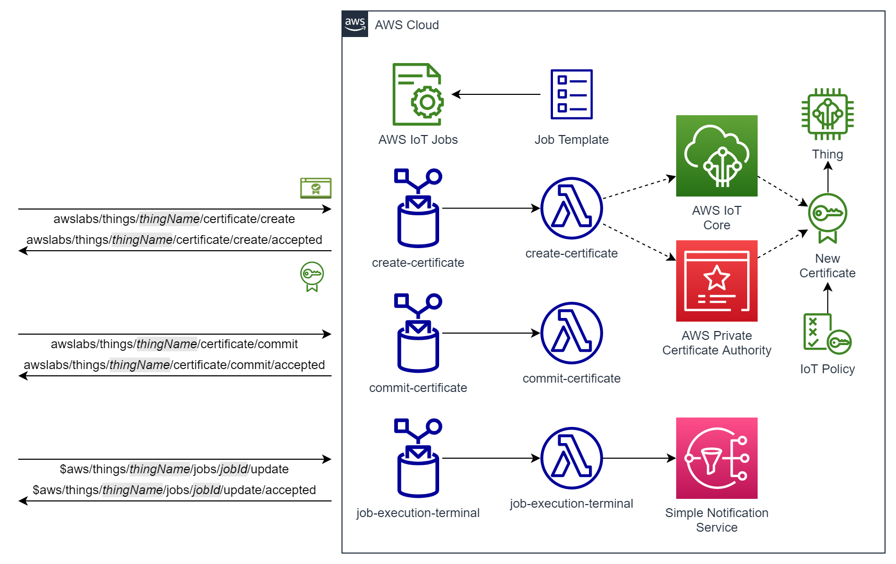

# Cloud Backend Stack

The cloud backend for the AWS Greengrass Certificate Rotator component is a TypeScript CDK application. 

# Table of Contents
* [Architecture](#architecture)
* [How to](#how-to)
    * [Prerequisites](#prerequisites)
    * [Build the application](#build-the-application)
    * [Run unit tests](#run-unit-tests)
    * [Context variables](#context-variables)
    * [Default context](#default-context)
    * [Deploy the cloud backend](#deploy-the-cloud-backend)

# Architecture

The cloud backend application consists of:

- Three Lambdas.
- Three AWS IoT Core rules that trigger the Lambdas based on received MQTT messages.
- An AWS IoT job template for creating certificate rotation jobs.
- A Simple Notification Service (SNS) topic for publishing error notifications at the conclusion of job executions.



The **create-certificate** Lambda uses either AWS IoT or AWS Private CA to issue new device certificates.

# How to

## Prerequisites

Follow the [Getting started with the AWS SDK guide (for Typescript)](https://docs.aws.amazon.com/cdk/latest/guide/getting_started.html) to install CDK and bootstrap your environment.

## Build the application

Compile TypeScript to JS.

```
npm run build
```

## Run unit tests

Uses the Jest framework.

```
npm run test
```

## Context variables

The CDK concept of [context](https://docs.aws.amazon.com/cdk/v2/guide/context.html) is used to configure the cloud backend to use either AWS IoT or AWS Private CA for issuing device certificates. AWS IoT is the default.  

The following context variables are used to configure AWS Private CA:

| Name                  | Description                                                                                       |
| --------------------- | ------------------------------------------------------------------------------------------------- |
| PcaCaId               | ID of the Private CA certificate to use for issuing device certificates.                          |
| PcaValidityInDays     | Number of days the device certificates issued by Private CA are valid for.                        |
| PcaSigningAlgorithm   | SHA256WITHECDSA, SHA384WITHECDSA, SHA512WITHECDSA, SHA256WITHRSA, SHA384WITHRSA or SHA512WITHRSA. |

The AWS Private CA signing algorithm is that used to sign the certificate issued by AWS Private CA. It is not the same as the signing algorithm used by the **aws.greengrass.labs.CertficiateRotator** component to sign the Certificate Signing Request (CSR). 

Note that the encryption family (RSA or ECC) of the AWS Private CA signing algorithm must match that of the CA's private key.

## Default context

Default context values are defined in [cdk.json](cdk.json) as follows:

```
"PcaCaId": "",
"PcaValidityInDays": "7", 
"PcaSigningAlgorithm": "SHA256WITHRSA"
```

With these defaults, Private CA is disabled and AWS IoT is selected.

Validity in days defaults to 7 so that the backend will work by default with private certificate authorities that are created in [short-lived mode](https://docs.aws.amazon.com/privateca/latest/userguide/short-lived-certificates.html#short). In a production environment, [general-purpose mode](https://docs.aws.amazon.com/privateca/latest/userguide/short-lived-certificates.html#standard) and a longer validity is likely a more appropriate choice.

## Deploy the cloud backend

Deploy with default context, meaning AWS IoT will issue device certificates.

```
cdk deploy
```

Deploy with a Private CA certificate ID to select Private CA to issue certificates. Default values for validity and signing algorithm will be used.

```
cdk deploy -c PcaCaId=deadbeef-1111-face-2222-0123456789ab
```

Deploy with Private CA enabled and the validity period set to 2 years.

```
cdk deploy -c PcaCaId=deadbeef-1111-face-2222-0123456789ab -c PcaValidityInDays=730
```

Deploy with Private CA enabled and a signing algorithm of **SHA384WITHRSA**.

```
cdk deploy -c PcaCaId=deadbeef-1111-face-2222-0123456789ab -c PcaSigningAlgorithm=SHA384WITHRSA
```

Deploy with Private CA enabled, with signing algorithm of **SHA512WITHRSA** and the validity period set to 10 years.

```
cdk deploy -c PcaCaId=deadbeef-1111-face-2222-0123456789ab -c PcaValidityInDays=3650 -c PcaSigningAlgorithm=SHA512WITHRSA
```
