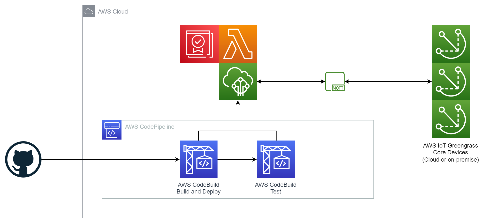

# CI/CD Pipeline Stack

The CI/CD pipeline for the AWS Greengrass Labs Certificate Rotator is a TypeScript CDK application that deploys a CodePipeline pipeline. This pipeline is intended for use in DEV, TEST or NON-PROD environments to support testing and development of this component and associated backend.

# Architecture



## Stages

The pipeline consists of two AWS CodeBuild stages:

* Build & Deploy
* Test

### Build & Deploy Stage

The build and deploy stage creates a new component version, publishes it to the AWS account and deploys it to a Thing group consisting of one or more Greengrass core devices.

Additionally, it builds and deploys the certificate rotator cloud backend.

### Test Stage

The test stage performs [system-level integration tests](../robot/README.md) to ensure that the component and backend can successfully cooperate to rotate certificates and private keys on all devices in the Thing group. It also covers a broad range of configuration options such as key algorithms, signing algorithms and selectable Certificate Authority.

## Source Code

Subject to [configuration using CDK context variables](#context-variables), the pipeline can consume a repository hosted in GitHub, GitHub Enterprise Server Bitbucket, GitLab or Azure DevOps. The user needs to create an [AWS CodeConnection](https://docs.aws.amazon.com/dtconsole/latest/userguide/connections.html) to the repository. 

As this project is hosted in GitHub, the most common scenario is that a user will fork the repository in GitHub and [create an AWS CodeConnection to the forked repository in GitHub](https://docs.aws.amazon.com/dtconsole/latest/userguide/connections-create-github.html). The connection ID can then be used in the CDK context.

Alternatively the user may clone the repository to elsewhere and configure the CDK context variables accordingly.

## Versioning

The pipeline generates an automated component pre-release version by appending the CodeBuild build number and short Git commit hash to the version number defined in **gdk-config.json**. 

## Notifications

The pipeline publishes success or failure notifications to an SNS topic named **AWSLabsCertificateRotatorPipelineNotification**.

## Test Reports

Unit and integration test reports are stored as build artifacts and [JUnit compatible reports in CodeBuild](https://docs.aws.amazon.com/codebuild/latest/userguide/test-reporting.html). 


# How to

## Prerequisites

Follow the [Getting started with the AWS SDK guide (for Typescript)](https://docs.aws.amazon.com/cdk/latest/guide/getting_started.html) to install CDK and bootstrap your environment.

## Install dependencies

```
npm install
```

## Build the application

Compile TypeScript to JS.

```
npm run build
```
## Run unit tests

Uses the Jest framework.

```
npm run test
```

## Context variables

The CDK concept of [context](https://docs.aws.amazon.com/cdk/v2/guide/context.html) is used to configure the CI/CD pipeline.

Synthesis and deployment of the stack uses the following context variables:

| Name             | Description                                                                                           | Default      |
| ---------------- | ----------------------------------------------------------------------------------------------------- | ------------ |
| ConnectionId     | The AWS CodeConnection connection ID of the repo, if hosted in GitHub, BitBucket, GitHub Enterprise Server, GitLab or Azure DevOps.  | None |
| OwnerName        | The name of the owner of the repo, if hosted in GitHub, BitBucket, GitHub Enterprise Server, GitLab or Azure DevOps.       | None |
| RepositoryName   | The name of the repository containing the source code.                                                | aws-greengrass-labs-certificate-rotator |
| BranchName       | The name of the branch to use in the repository.                                                      | main         |
| ThingGroupName   | The name of the Thing group of Greengrass core device(s) to which the component should be deployed.   | None         |
| PcaCaId          | ID of the AWS Private CA certificate to use for issuing device certificates.                          | None         |

Default context values are defined in [cdk.json](cdk.json).

The **ConnectionId** is the UUID at the end of the AWS CodeConnection ARN.

As there is no default for **ConnectionId**, **OwnerName**, **ThingGroupName** or **PcaCaId**, they must be supplied in the command line of every synthesis or deployment, or added to the default context in your cloned or forked repository.

The **PcaCaId** value is only used for a subset of test cases in the integration tests.

## Deploy the pipeline

Example deployment:

```
cdk deploy -c ThingGroupName=MyCoreDevicesThingGroup -c PcaCaId=deadbeef-1111-face-2222-0123456789ab -c ConnectionId=feedface-3333-bead-4444-0123456789ab -c OwnerName=MyOwnerName
```
