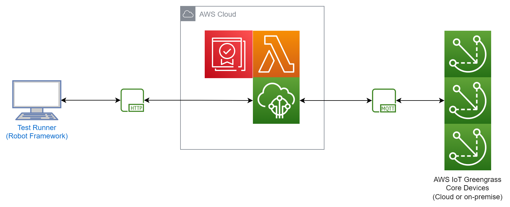

# AWS Labs Greengrass Certificate Rotator Automated Integration Tests

The automated integration test suite uses [Robot Framework](https://robotframework.org/) as a test harness.

## Architecture

A developer machine can be used as the test runner, and a Thing group of Greengrass core devices are the devices under test. These devices may be virtual in the cloud, or physical on-premise, such as a test fleet in the lab. Test cases exercise the cloud backend, and the component on the fleet of core devices, principally by creating Greengrass deployments and certificate rotation jobs, and checking the outcome.



## Installation

To install Robot Framework and additional required packages.

```
pip3 install -r robot/requirements.txt
```
## User Guide

[Robot Framework User Guide](https://robotframework.org/robotframework/latest/RobotFrameworkUserGuide.html)

## Test Suite Execution

The test suite demands that the following information be passed as variables:

* `THING_GROUP_NAME`: The name of the Thing group containing the Greengrass core devices that are the devices under test.
* `PCA_CA_ID`: The ID of the AWS Private Certficate Authority that the suite should use to test issuance of certificates using AWS Private CA.

The CA certificate can use either an RSA or EC key algorithm. The test suite will automatically skip test cases that do not match the key algorithm.

```
robot --pythonpath libs --variable THING_GROUP_NAME:MyCoreDevicesThingGroup --variable PCA_CA_ID:deadbeef-1111-face-2222-0123456789ab --xunit results.xml suites
```

## Output

Test progress and high level outcomes are indicated on standard out. Example execution with a CA in AWS Private CA that has an RSA key:

```
robot --pythonpath libs --variable THING_GROUP_NAME:AWSLabsCertificateRotatorPipeline --variable PCA_CA_ID:402c51bd-63be-4a12-bfd7-3a2866f924ae --xunit results.xml suites
==============================================================================
Suites :: AWS Labs Greengrass Certificate Rotator test suite                  
==============================================================================
Suites.1-Invalid-Configuration :: Component invalid configuration checks      
==============================================================================
Invalid key algorithm                                                 | PASS |
------------------------------------------------------------------------------
Invalid signing algorithm                                             | PASS |
------------------------------------------------------------------------------
Mismatch: RSA-2048 with ECDSA-WITH-SHA256                             | PASS |
------------------------------------------------------------------------------
Mismatch: RSA-2048 with ECDSA-WITH-SHA384                             | PASS |
------------------------------------------------------------------------------
Mismatch: RSA-2048 with ECDSA-WITH-SHA512                             | PASS |
------------------------------------------------------------------------------
Mismatch: RSA-3072 with ECDSA-WITH-SHA256                             | PASS |
------------------------------------------------------------------------------
Mismatch: RSA-3072 with ECDSA-WITH-SHA384                             | PASS |
------------------------------------------------------------------------------
Mismatch: RSA-3072 with ECDSA-WITH-SHA512                             | PASS |
------------------------------------------------------------------------------
Mismatch: ECDSA-P256 with SHA256WITHRSA                               | PASS |
------------------------------------------------------------------------------
Mismatch: ECDSA-P256 with SHA384WITHRSA                               | PASS |
------------------------------------------------------------------------------
Mismatch: ECDSA-P256 with SHA512WITHRSA                               | PASS |
------------------------------------------------------------------------------
Mismatch: ECDSA-P256 with SHA256WITHRSAANDMGF1                        | PASS |
------------------------------------------------------------------------------
Mismatch: ECDSA-P256 with SHA384WITHRSAANDMGF1                        | PASS |
------------------------------------------------------------------------------
Mismatch: ECDSA-P256 with SHA512WITHRSAANDMGF1                        | PASS |
------------------------------------------------------------------------------
Mismatch: ECDSA-P384 with SHA256WITHRSA                               | PASS |
------------------------------------------------------------------------------
Mismatch: ECDSA-P384 with SHA384WITHRSA                               | PASS |
------------------------------------------------------------------------------
Mismatch: ECDSA-P384 with SHA512WITHRSA                               | PASS |
------------------------------------------------------------------------------
Mismatch: ECDSA-P384 with SHA256WITHRSAANDMGF1                        | PASS |
------------------------------------------------------------------------------
Mismatch: ECDSA-P384 with SHA384WITHRSAANDMGF1                        | PASS |
------------------------------------------------------------------------------
Mismatch: ECDSA-P384 with SHA512WITHRSAANDMGF1                        | PASS |
------------------------------------------------------------------------------
Mismatch: ECDSA-P521 with SHA256WITHRSA                               | PASS |
------------------------------------------------------------------------------
Mismatch: ECDSA-P521 with SHA384WITHRSA                               | PASS |
------------------------------------------------------------------------------
Mismatch: ECDSA-P521 with SHA512WITHRSA                               | PASS |
------------------------------------------------------------------------------
Mismatch: ECDSA-P521 with SHA256WITHRSAANDMGF1                        | PASS |
------------------------------------------------------------------------------
Mismatch: ECDSA-P521 with SHA384WITHRSAANDMGF1                        | PASS |
------------------------------------------------------------------------------
Mismatch: ECDSA-P521 with SHA512WITHRSAANDMGF1                        | PASS |
------------------------------------------------------------------------------
Suites.1-Invalid-Configuration :: Component invalid configuration ... | PASS |
26 tests, 26 passed, 0 failed
==============================================================================
Suites.2-Rotation-Aws-Private-Ca :: Rotate with AWS Private CA as issuer      
==============================================================================
AWS Private CA with certificate signing SHA256WITHRSA                 | PASS |
------------------------------------------------------------------------------
AWS Private CA with certificate signing SHA384WITHRSA                 | PASS |
------------------------------------------------------------------------------
AWS Private CA with certificate signing SHA512WITHRSA                 | PASS |
------------------------------------------------------------------------------
AWS Private CA with certificate signing SHA256WITHECDSA               | SKIP |
Signing algorithm doesn't match CA key algorithm family
------------------------------------------------------------------------------
AWS Private CA with certificate signing SHA384WITHECDSA               | SKIP |
Signing algorithm doesn't match CA key algorithm family
------------------------------------------------------------------------------
AWS Private CA with certificate signing SHA512WITHECDSA               | SKIP |
Signing algorithm doesn't match CA key algorithm family
------------------------------------------------------------------------------
Suites.2-Rotation-Aws-Private-Ca :: Rotate with AWS Private CA as ... | PASS |
6 tests, 3 passed, 0 failed, 3 skipped
==============================================================================
Suites.3-Rotation-Aws-Iot-Ca :: Rotate with AWS IoT CA as issuer              
==============================================================================
AWS IoT CA with RSA-2048 key and SHA256WITHRSA CSR                    | PASS |
------------------------------------------------------------------------------
AWS IoT CA with RSA-2048 key and SHA384WITHRSA CSR                    | PASS |
------------------------------------------------------------------------------
AWS IoT CA with RSA-2048 key and SHA512WITHRSA CSR                    | PASS |
------------------------------------------------------------------------------
AWS IoT CA with RSA-2048 key and SHA256WITHRSAANDMGF1 CSR             | PASS |
------------------------------------------------------------------------------
AWS IoT CA with RSA-2048 key and SHA384WITHRSAANDMGF1 CSR             | PASS |
------------------------------------------------------------------------------
AWS IoT CA with RSA-2048 key and SHA512WITHRSAANDMGF1 CSR             | PASS |
------------------------------------------------------------------------------
AWS IoT CA with RSA-3072 key and SHA256WITHRSA CSR                    | PASS |
------------------------------------------------------------------------------
AWS IoT CA with RSA-3072 key and SHA384WITHRSA CSR                    | PASS |
------------------------------------------------------------------------------
AWS IoT CA with RSA-3072 key and SHA512WITHRSA CSR                    | PASS |
------------------------------------------------------------------------------
AWS IoT CA with RSA-3072 key and SHA256WITHRSAANDMGF1 CSR             | PASS |
------------------------------------------------------------------------------
AWS IoT CA with RSA-3072 key and SHA384WITHRSAANDMGF1 CSR             | PASS |
------------------------------------------------------------------------------
AWS IoT CA with RSA-3072 key and SHA512WITHRSAANDMGF1 CSR             | PASS |
------------------------------------------------------------------------------
AWS IoT CA with ECDSA-P256 key with ECDSA-WITH-SHA256 CSR             | PASS |
------------------------------------------------------------------------------
AWS IoT CA with ECDSA-P256 key with ECDSA-WITH-SHA384 CSR             | PASS |
------------------------------------------------------------------------------
AWS IoT CA with ECDSA-P256 key with ECDSA-WITH-SHA512 CSR             | PASS |
------------------------------------------------------------------------------
AWS IoT CA with ECDSA-P384 key with ECDSA-WITH-SHA256 CSR             | PASS |
------------------------------------------------------------------------------
AWS IoT CA with ECDSA-P384 key with ECDSA-WITH-SHA384 CSR             | PASS |
------------------------------------------------------------------------------
AWS IoT CA with ECDSA-P384 key with ECDSA-WITH-SHA512 CSR             | PASS |
------------------------------------------------------------------------------
AWS IoT CA with ECDSA-P521 key with ECDSA-WITH-SHA256 CSR             | PASS |
------------------------------------------------------------------------------
AWS IoT CA with ECDSA-P521 key with ECDSA-WITH-SHA384 CSR             | PASS |
------------------------------------------------------------------------------
AWS IoT CA with ECDSA-P521 key with ECDSA-WITH-SHA512 CSR             | PASS |
------------------------------------------------------------------------------
Suites.3-Rotation-Aws-Iot-Ca :: Rotate with AWS IoT CA as issuer      | PASS |
21 tests, 21 passed, 0 failed
==============================================================================
Suites.4-Rotation-Failures :: Rotation failures and rollback                  
==============================================================================
Failure if create times out                                           | PASS |
------------------------------------------------------------------------------
Rollback if re-connection fails                                       | PASS |
------------------------------------------------------------------------------
Rollback if commit times out                                          | PASS |
------------------------------------------------------------------------------
Suites.4-Rotation-Failures :: Rotation failures and rollback          | PASS |
3 tests, 3 passed, 0 failed, 0 skipped
==============================================================================
Suites :: AWS Labs Greengrass Certificate Rotator test suite          | PASS |
56 tests, 53 passed, 0 failed, 3 skipped
==============================================================================
Output:  /home/user/git/aws-greengrass-labs-certificate-rotator/robot/output.xml
XUnit:   /home/user/git/aws-greengrass-labs-certificate-rotator/robot/results.xml
Log:     /home/user/git/aws-greengrass-labs-certificate-rotator/robot/log.html
Report:  /home/user/git/aws-greengrass-labs-certificate-rotator/robot/report.html
```

The __log.html__ file is a detailed time-stamped log. This is saved as an artifact of the test stage of the CI/CD pipeline.

The __results.xml__ file is a JUnit-compatible output file that is suitable for ingestion by most CI/CD tools. It is used in the CodePipeline pipeline test stage to produce a test report.
